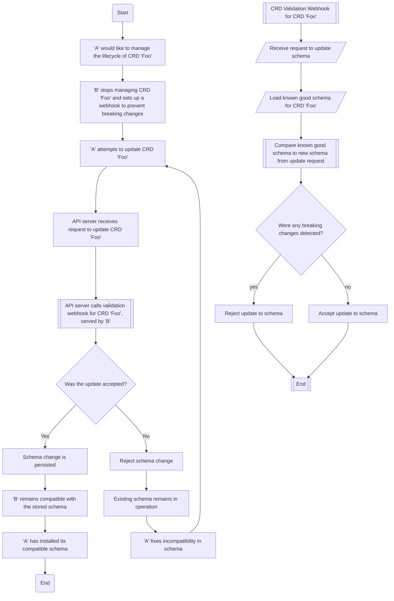

# Lifecycling Cluster API CRDs within OpenShift

## Summary

We are on the cusp on introducing a new suite of APIs into OpenShift, the Cluster API or CAPI APIs.
We know already that OpenShift clusters are running these APIs, be that within HyperShift, MCE or even as customer workloads today.
As we introduce these APIs into OpenShift's core payload, we need to ensure that we do not break existing use cases,
and that we allow these use cases to continue to manage CRDs, in a way that does not break our core usage.

## Motivation

### User Stories

* As an existing OpenShift cluster, using the latest upstream Cluster API, I need to disable OpenShift's management of Cluster API CRDs so that it does not downgrade or otherwise make a breaking change to the CRDs, for my existing workloads.
* As a member of the HyperShift team, I need to be able to disable OpenShift's management of Cluster API CRDs, so that I can install newer CRDs with newer features into HyperShift management clusters within ROSA and ARO.
* As a member of the core OpenShift Cluster Infrastructure team, I need to be able to implement checks that ensure that any installed/updated Cluster API CRDs, are compatible with the controller versions that are running within any specific OpenShift payload version.
* As a member of the core OpenShift Cluster Infrastructure team, I need to implement a way for clusters to signal that the Cluster API CRDs should be considered external to the payload, prior to the GA of any core Cluster API CRDs in OpenShift.
* As an engineer who owns a Cluster API component, I want to understand the compatibility matrix of CRD versions across different products, so that I can ensure that the CRDs I'm managing will be accepted and compatible with the version of OpenShift I'm running on top of.

### Goals

* Allow actors external to the core payload (HyperShift, MCE, Customers) to **stop** the management of Cluster API CRDs from within the core OpenShift product
* Allow configuration of a subset of Cluster API CRDs to be considered unmanaged
* Build tooling to prevent CRDs being upgraded in a way that would break the payload installed controllers
* Define how CRD upgrades will be expected to work when both managed, and unmanaged, and how core controllers will be upgraded
* Define handling of deprecation cycles and policy for migration between API versions within Cluster API
* Define a pattern for preventing the GA of Cluster API within OpenShift from stomping existing Cluster API CRDs

### Non-Goals

* Allow unmanaged CRDs to later become managed again

## Proposal

To allow existing clusters, which already have Cluster API CRDs installed, and managed by other components, the Cluster CAPI Operator will implement a way to yield management of any CRD that it would typically manage.
Cluster admins will need to, prior to upgrading to a version of OpenShift that includes the Cluster CAPI Operator, configure the operator CRD to disable management of the CRDs that they wish to manage themselves,
should there be any within the cluster.

To ensure the continued, and functional operation of the core Cluster API components managed by the Cluster CAPI Operator, the operator will validate both CRD and operand upgrades,
against the installed schema of the CRDs that it relies on.
By blocking CRD upgrades that introduce problematic changes, and only installing an upgraded version of the operand when the schema is compatible,
we can ensure that the CAPI operands are always operating against a compatible CRD schema.

### Workflow Description

#### For a cluster that already has Cluster API CRDs installed

We know that there are already clusters running Cluster API CRDs, be that within HyperShift, MCE or even as customer workloads today.
For these clusters, we must allow them to continue to manage the CAPI CRDs that they have installed, without the Cluster CAPI Operator trying to take ownership of them.

For the sake of the following example, we will assume that 4.N is the first version of OpenShift that includes the Cluster CAPI Operator, in it's fully functional mode, in the stable channel.

1. The cluster admin upgrades into a version of 4.N-1 that includes the Cluster CAPI Operator in a reduced mode, where it implements pre-upgrade checks, and does not yet manage and CRDs, or install any operands.
1. The Cluster CAPI Operator detects that the cluster has a CRD installed that also exists within the Cluster CAPI Operator's transport configmaps[^2].
1. The Cluster CAPI Operator marks itself as `Upgradeable=False`, with a message showing that one or more CRDs are already installed.
1. The cluster admin configures the Cluster CAPI Operator to disable management of the CRDs that are already installed.
1. The Cluster CAPI Operator now reports `Upgradeable=True`, and the cluster admin can proceed with the upgrade to 4.N.
1. Once upgraded to 4.N, the Cluster CAPI Operator will not attempt to manage the CRDs that are already installed, and listed in the `UnmanagedAPIs` field of the operator CRD.

[^2]: The transport configmaps are used in this feature to deliver the CRD schemas for the operand to the Cluster CAPI Operator

#### For a cluster that is installing Cluster API CRDs for the first time

In this example, we assume that the cluster is either installed with the Cluster CAPI operator initially, or has been upgraded into a version of OpenShift that includes the Cluster CAPI Operator in a fully functional mode.

The cluster admin in this case has an operational CAPI environment within the cluster, and the cluster is managing its own CAPI CRDs.

The cluster admin now wishes to install a newer version of a CAPI CRD, than exists in the cluster payload.

1. The cluster admin adds the name of the CRD to the `UnmanagedAPIs` field of the Cluster CAPI Operator CRD spec.
1. The Cluster CAPI Operator ensures a ValidatingAdmissionWebhook is configured to validate updates for CRDs (this may already be present if the list is not empty).
1. The Cluster CAPI Operator configures the webhook to ensure updates to this newly unmanaged CRD are validated.
1. The Cluster CAPI operator updates the `ObservedGeneration` field in the status to reflect that it has acted upon the desired new configuration.
1. The cluster admin is now responsible for managing the CRD lifecycle going forward.

#### When a new version of a CRD is introduced

In this example, we assume that the cluster is running, and that the admin has already marked a particular CRD as unmanaged.
They now wish to upgrade to a new version of the CRD, this time, with a v1 schema, where previously the CRD was v1alpha1.
We assume initially that they have applied an incorrect update[^3].

[^3]: This initial example would actually be rejected by the API server anyway, as the CRD would already have v1alpha1 stored versions.

1. The cluster admin applies the new CRD to the cluster, which only has the v1 schema.
1. The validation webhook detects that the new CRD does not contain the v1alpha1 schema, and rejects the update.
1. The cluster admin updates the CRD manifest to include both v1 and v1alpha1 schemas.
1. The cluster admin deploys the required conversion webhook for the v1alpha1 to v1 conversion.
1. The cluster admin tries to update the CRD again, and this time, the update is accepted.

Over time, the admin upgrades various components and now decides it is time to remove the v1alpha1 schema from the CRD.

1. The cluster admin applies the CRD to the cluster without the old v1alpha1 schema.
1. The validation webhook detects that it still requires the v1alpha1 schema, and rejects the update.
1. The cluster admin upgrades their cluster to a newer version of OpenShift.
1. The Cluster CAPI Operator runs pre-flight checks and detects that the newly required v1 schema is present already in the installed schema.
1. The Cluster CAPI Operator also detects that the required v1alpha1 schema is present in the installed schema.
1. The Cluster CAPI Operator allows the upgrade of the operand to proceed.
1. The webhook's version of the schema is updated to reflect the new version of the schema.
1. The Cluster CAPI Operator now requires both the v1 and v1alpha1 schemas to be present in the CRD.
1. The cluster admin again tries to update the CRD, but it is still rejected as the v1alpha1 schema is missing.
1. The cluster admin upgrades the cluster again, this time to a version that no longer requires the v1alpha1 schema.
1. The Cluster CAPI Operator pre-flight checks pass, and it upgrades the operand. 
1. The webhook's version of the schema is updated to reflect the new version of the schema. It no longer requires the v1alpha1 schema to be present in the CRD.
1. The cluster admin can now update the CRD to remove the v1alpha1 schema.

#### When fields are removed from the schema, without a version bump

Over time, it is possible that fields may be removed from schemas, without a version bump.
For example, Cluster API is introducing a `v1beta1` field into the status of their core CRDs that will exist for some time, marked as deprecated,
before being removed when the conversion between v1beta1 and v1beta2 is no longer required.

Normally, the Cluster CAPI Operator would reject such removal of fields, as this would represent a breaking change.
However, by following the correct process, this change should be allowed.

1. The cluster admin applies the CRD to the cluster, with the field removed.
1. The validation webhook detects that the field is missing, and rejects the update.
1. The cluster admin upgrades the cluster to a newer version of OpenShift.
1. The Cluster CAPI Operator runs pre-flight checks, this time the schema from the payload does not include the field. 

    a. As the payload version is used as the base schema, the installed schema looks like it has a new field, when compared with the payload schema.

1. The Cluster CAPI Operator allows the upgrade of the operand to proceed.
1. The webhook's version of the schema is updated to reflect the new version of the schema.
1. The cluster admin applies the CRD again to the cluster, with the field removed.
1. This time the webhook accepts the request, the removed field no longer exists in the webhook's version of the schema.

### API Extensions

#### Unmanaged APIs

We will introduce a new CRD in the `operator.openshift.io` API group that will be used to configure the Cluster CAPI Operator.
Within this new operator spec, we will allow configuration to disable management of particular CRDs within the Cluster CAPI Operator's purview.

The following validations will apply:
* Each entry in the list should be unique
* Each entry in the list should be a fully qualified resource name (the name of a CRD)
* Once added, entries in the list cannot be removed - We do not want to stomp a third party version of a CRD, once the third party has taken over the management

```golang
type CAPISpec struct {
  // unmanagedAPIs is a list of Cluster API related CRDs that should be considered unmanaged
  // by the cluster. When specified, an add-on such as Multi-Cluster Engine should be used to
  // manage the CRD going forward.
  // Once a CRD becomes unmanaged, it cannot become managed again; entries in this list may not be removed.
  // The CAPI Operator will validate updates to unmanaged CRDs to prevent incompatible changes.
  // When an incompatible change is rejected, please update the OpenShift version before trying again.
  // Values should consist only of lower-case alphanumeric characters, periods (.) and hyphens (-), and should start and end with an alphanumeric character.
  // Values should be at most 253 characters in length.
  // +kubebuilder:validation:XValidation:rule="oldSelf.exists(x, self.exists(y, x == y))",message="unmanagedAPIs may not be removed once they have been made unmanaged"
  // +kubebuilder:validation:XValidation:rule="self.exists_one(x, self.exists(y, x == y))",message="unmanagedAPIs must be unique"
  // +kubebuilder:validation:MaxLength:=128 # How many CRDs does the operator manage? This should be ample even if all 8 platforms get installed at once
  // +optional
  UnmanagedAPIs []UnmanagedAPI `json:"unmanagedAPIs"`

  ... 
}

// UnmanagedAPI is a string representing a CRD name that could be managed by the cluster CAPI operator.
// TODO: Should we enum this? If we don't, we should at least regex check the API groups
// +kubebuilder:validation:XValidation:rule="!format.dns1123Subdomain().validate(self).hasValues()",message="unmanagedAPI must be a fully qualified CRD name. It must consist only of lower case alphanumeric characters, hyphens and periods, and must start and end with an alphanumeric character."
// +kubebuilder:validation:MaxLength:=253
type UnmanagedAPI string
```

When a particular CRD name is present in the list, the Cluster CAPI operator will yield management
of the resource and assume that another entity is now responsible for the CRD.

We expect this field primarily to be populated by the HyperShift Operator or MCE, though,
it may also be populated by an end-user who is using Cluster API as a workload atop OpenShift.

Once a value has been added to the spec field, the operator will verify that the ValidatingAdmissionWebhook is configured,
configure the webhook to validate updates to the CRD, and update the `ObservedGeneration` field in the status to reflect that it has acted upon the desired new configuration.
This provides a signal to the cluster admin that it is now safe to manage the CRD themselves.

### Topology Considerations

#### Hypershift / Hosted Control Planes

HyperShift will be required, once the management cluster reaches a version prior to the general availability of Cluster API within OpenShift,
to configure the new CAPI operator API to disable management of the CRDs that HyperShift operator is already managing.

Over time, if the HyperShift operator adds new CRDs to its own management, it will need to continue to update the list of unmanaged CRDs.

It is recommended that HyperShift also implements a similar pattern of upgrade validation for its operands to ensure that they are compatible with the installed schema.

HyperShift will be required to maintain API compatibility between the CRDs it manages and the controllers that are running within the management cluster, deployed from the payload.
This may mean over time, that HyperShift will be required to deploy and maintain conversion webhooks to ensure that the CRDs it manages are compatible with the controllers that are running within the management cluster.

#### Standalone Clusters

The workflows and extensions described in this enhancement are targetted at standalone clusters.

#### Single-node Deployments or MicroShift

Cluster API, much like Machine API, is not expected to be used on MicroShift.

### Implementation Details/Notes/Constraints

#### CRD Upgrade Validation

Once a CRD becomes unmanaged, the Cluster CAPI operator needs to ensure that any changes to the CRDs
that it relies on for core OpenShift functionality are not changed in a way such that the core operations
would be ill-effected.

To prevent these changes, the Cluster CAPI Operator will install a ValidatingAdmissionWebhook against CRD resources
that will check all updates to CRDs.

For CRDs that it knows about, it will validate against the embedded[^1] schema for the payload version, that the update does not violate compatibility.

[^1]: CRDs are fed to the CAPI operator within the payload via transport configmaps.

The validation webhook will be required to load all known CRDs from the transport configmaps to be able to correctly validate the CRD updates.
The operator can then filter the CRDs it needs to check based on those that are not required for the current cluster platform.

It will leverage the OpenShift [crd-schema-checker][crd-schema-checker] project and in particular, the validations within to assert:
* The API version required for this payload version is included within the new version of the CRD
* No fields have been removed when compared against the current schema
* No enum values have been removed when compared against the current schema
* No new required fields have been added to the schema

[crd-schema-checker]: https://github.com/openshift/crd-schema-checker

These checks will ensure that, should a third party be updating the CRD once unmanaged, that the core payload controllers should continue to function unhampered.

Once implemented, a similar pattern could be leveraged within the HyperShift Operator and MCE to ensure similar compatibility checks.



#### Operand Upgrade Validation

Similar checks will also be leveraged on cluster level upgrades, where the Cluster CAPI operator will run pre-flight checks 
on CRD upgrades prior to upgrading any operand that may rely on a CRD that may otherwise be considered broken.

When the operator detects a new version of the operand, it will check the new operand's CRD schema against the installed cluster schema.
With the new version of the CRD as the base, and the installed schema as the "updated" schema in the previous workflow,
this will ensure that all of the fields in the CRD for the new version of the operand, exist in the installed schema.

When the operator detects that the installed schema is not compatible, it will block the upgrade of the operand until the CRD is updated.
The ClusterOperator will be marked as degraded to signal that manual intervention is required.

The cluster admin will be required to interpret the error from this validation and resolve the conflict by upgrading the installed schema.
For example, if the new version of the operand relies on a new field, not present in the currently installed schema, then this would mean
that the admin must upgrade the schema to include the new field. Once upgraded, the operator can continue with upgrading the operand.

In the mean time, the old version of the operand will continue to run, as it is known to be compatible with the current schema.

Only once the new version of the operand is running, will the validation webhook be updated to reflect the new schema.

This check will also be run as part of the initial installation of the CAPI operands.
This ensures that any existing CRDs are compatible initially with the operands to be installed.

The combination of this check, and the CRD upgrade check, ensure that the installed CRD schema is always compatible with the installed controllers.

#### Deployment of the admission webhook

The admission webhook should be deployed as a separate operand of the Cluster CAPI Operator.
We do not want to tie the webhook to OpenShift specifically, and as such, it should be built in a way that it does not,
for core functionality, rely on OpenShift specific features.

For our use case, the simplest path is likely to deploy the webhook as a deployment, and mount CRD schemas into a path within the container.
Each time a new API is added to the list of unmanaged APIs, the webhook will be redeployed, with a newly mounted CRD schema within its filesystem.

The webhook itself will be configured to point to a path within the container, where it will find CRD schemas to validate.

If it receives a request for a CRD update and it does not have a schema available, it should ignore the request, and allow the update to proceed.

##### Ensuring the correct version of the schema

The webhook must always have the version of the schema for the installed version of the operand.
In particular, this means that its source cannot be tied to the OpenShift payload, but rather must be copied from the payload
only once the upgrade of the operand has succeeded.

To achieve this, the webhook will source its versions of the schema, for the purpose here known as the "known good schema",
from a configmap that is mounted into the container.

When the Cluster CAPI Operator successfully upgrades an operand, if the CRDs from that operand's transport configmap are unmanaged,
the operator will copy the content of the CRD schema into the webhook's configmap.

This ensures that the webhook is always validating against the correct version of the schema, and prevents the CVO from potentially
stomping the schema that the webhook is validating by upgrading the transport configmap, prior to the Cluster CAPI Operator validating the upgrade.

#### CRD Versions over time

Over time, we expect the CRD schemas for certain APIs to evolve, primarily here we will focus on core Cluster API CRDs.
New fields will be added, and over time, new versions of the API will be introduced.
Cluster API provides conversion webhooks for their CRDs, generally providing several releases of compatibility between versions.

HyperShift for example, currently uses OpenShift 4.14 for management clusters, and will ship OpenShift 4.18 managed clusters on these.
That means the skew we need to support is at least 2 years of OpenShift releases, and potentially more.

Cluster API is currently migrating toward a v1beta2 API, and we expect that this version will be the first to be supported by OpenShift.
Per OpenShift guidelines, beta APIs must be supported for a minimum of 3 minor releases, a year in OpenShift terms.

It is also expected that the Cluster API community move towards v1 after the v1beta2 release of the core APIs.
Once this migration is done, we will expect HyperShift to ship and maintain the v1beta2 conversion webhook until such a time that their
management clusters are no longer running any v1beta2 CRDs.
This may be several years, and may require the conversion webhook to be maintained for a longer than the period for which the upstream
community would normally support their conversion webhooks.

### Risks and Mitigations

#### Race Conditions between the operand and webhook updates

There is a small period of time between the Cluster CAPI Operator updating an operand, to a newer version, and the webhook being updated to reflect the new schema.
During this time, the webhook will be validating any CRD updates against an older version of the schema.

If the new operand's schema includes more fields than the old schema, there is a small window of opportunity where a CRD update could remove a field, and the webhook would not detect it.

We do not expect this window to be long, but there is little we can do to mitigate this.
Similar version skew will happen for any operand and CRD update, they are rarely in tandem.

The ValidatingAdmissionWebhook will reject failed webhook attempts to prevent CRD upgrades when the webhook is being updated/restarted.

#### Upstream conversion is removed prior to our version skew requirements

For HyperShift, we expect a large version skew between the managed and management clusters.
This means there is a potential large drift between the Cluster API operands within the HyperShift cluster namespaces,
and the operands within the management cluster itself.

If, over time, the upstream moves API versions, and eventually removes support for an older version, but HyperShift is still installing on a
management cluster version of OpenShift relying on the older version, then the upstream code will no longer be compatible with the management cluster.

To mitigate this, HyperShift/OpenShift will likely need to delay the removal of the API and conversion webhooks within our forks of the Cluster API code.
Ideally this will be done atomically upstream within a single PR, and we will be able to carry reverts of the upstream changes until such a time that we are ready to move forward.

### Drawbacks

#### Validation webhooks

Validation webhooks extend the API request time and are not always reliable.
If the webhook is down, then the API server will not be able to validate the request, and should reject the update to fail safe.

Unfortunately, given the complexity of the validations required, there is no in-tree method to validate the CRD changes that could be applied here.

#### Allowing third party CRDs increases support complexity

By allowing third parties to manage the CRDs, we increase the support complexity of Cluster API on OpenShift.
We may no longer be able to easily reproduce issues that are reported, as the standard cluster will not represent the same state as the reported cluster.

We will need to be conscious of unmanaged CRDs when debugging issues, and potentially even reproduce issues against the third-party versions of the CRD.

#### Newer schemas means that data may be admitted, but not acted upon

When a schema is updated, it will likely allow new fields to be admitted within CRs, that the cluster CAPI operands do not understand.

In this case, a user could persist data to etcd, thinking that the field is being acted upon, where in fact it is not.
This may also pose a risk during upgrades, where the persisted data suddenly is acted upon, as the operand now understands the new field.

This could be confusing, and even potentially dangerous depending on the field.

Since most CAPI resources are considered to be immutable once created (e.g. Machines, MachineTemplates),
the real world risk here is relatively low.
The likely visible outcome of this would only happen when scaling new Machines, post a cluster upgrade.
Existing Machines would not be generally affected.

## Open Questions

1. What is the overlap of CRDs between core OCP and MCE/HCP, where could there be drift (does this actually matter? The mechanism is generic)
1. How log do we need to keep old API versions around, once a new version is introduced (depends on range of supported versions)
1. Should validations be implemented to check that CRs admitted to the CAPI namespace only contain fields that are present in the payload CRD schema?

## Test Plan (TBD)

**Note:** *Section not required until targeted at a release.*

Consider the following in developing a test plan for this enhancement:
- Will there be e2e and integration tests, in addition to unit tests?
- How will it be tested in isolation vs with other components?
- What additional testing is necessary to support managed OpenShift service-based offerings?

No need to outline all of the test cases, just the general strategy. Anything
that would count as tricky in the implementation and anything particularly
challenging to test should be called out.

All code is expected to have adequate tests (eventually with coverage
expectations).

## Graduation Criteria (TBD)

**Note:** *Section not required until targeted at a release.*

Define graduation milestones.

These may be defined in terms of API maturity, or as something else. Initial proposal
should keep this high-level with a focus on what signals will be looked at to
determine graduation.

Consider the following in developing the graduation criteria for this
enhancement:

- Maturity levels
  - [`alpha`, `beta`, `stable` in upstream Kubernetes][maturity-levels]
  - `Dev Preview`, `Tech Preview`, `GA` in OpenShift
- [Deprecation policy][deprecation-policy]

Clearly define what graduation means by either linking to the [API doc definition](https://kubernetes.io/docs/concepts/overview/kubernetes-api/#api-versioning),
or by redefining what graduation means.

In general, we try to use the same stages (alpha, beta, GA), regardless how the functionality is accessed.

[maturity-levels]: https://git.k8s.io/community/contributors/devel/sig-architecture/api_changes.md#alpha-beta-and-stable-versions
[deprecation-policy]: https://kubernetes.io/docs/reference/using-api/deprecation-policy/

**If this is a user facing change requiring new or updated documentation in [openshift-docs](https://github.com/openshift/openshift-docs/),
please be sure to include in the graduation criteria.**

**Examples**: These are generalized examples to consider, in addition
to the aforementioned [maturity levels][maturity-levels].

### Dev Preview -> Tech Preview (TBD)

- Ability to utilize the enhancement end to end
- End user documentation, relative API stability
- Sufficient test coverage
- Gather feedback from users rather than just developers
- Enumerate service level indicators (SLIs), expose SLIs as metrics
- Write symptoms-based alerts for the component(s)

### Tech Preview -> GA (TBD)

- More testing (upgrade, downgrade, scale)
- Sufficient time for feedback
- Available by default
- Backhaul SLI telemetry
- Document SLOs for the component
- Conduct load testing
- User facing documentation created in [openshift-docs](https://github.com/openshift/openshift-docs/)

**For non-optional features moving to GA, the graduation criteria must include
end to end tests.**

### Removing a deprecated feature

No features are to be removed as a part of this enhancement.

## Upgrade / Downgrade Strategy

The main upgrade time considerations are described in [Operand Upgrade Validation](#operand-upgrade-validation).
When an upgrade fails, because of the implemented checks, the existing operand will continue to function.
Rolling back to the previously installed version will rollback only the operator, at which point the degraded condition should clear.

Downgrades will work in the same way as upgrades once the feature is implemented.
The operator will, before it deploys a new operand, check that the API schema installed is compatible with
the installed CRD version.

Where there is an incompatible change, the operator will degrade and the cluster admin will be expected to
resolve whatever conflict has manifested in the CRD versions.

In most cases, downgrades should be compatible.
An older operand typically requires fewer fields than that of a newer operand, unless some field has been removed.
Removal of fields is rare within Cluster API but will happen on certain occasions as boundaries are passed
(e.g. the removal of v1beta1 after the entire cluster is upgraded to v1beta2).

## Version Skew Strategy

For the purposes of version skew, we will consider Cluster API within the core payload,
within MCE, and within the HyperShift operator that may be deployed on top.

For the purposes of the core payload, we will refer to the Cluster API here as the **base version**.
Within a Y-stream of an OpenShift release, this CRD is expected to only change in ways that are additive, eg new fields.
There should be no breaking changes, there should be no changes of API versions of Cluster API provider contracts.

MCE ships 1:1 with OpenShift, incrementing its Y-stream for each new Y-stream of OpenShift.
MCE supports N-2 through to N+2 versions of OpenShift, away from the base version.
Since MCE ties its Cluster API assets to the release to which it is paired, this is equivalent to OpenShift needing to support +/- 2 base versions.

The HyperShift operator can be used to deploy OpenShift versions up to and including the version it is built against.
That is to say, that a 4.17 version of the HyperShift operator cannot deploy a 4.18 or newer release.
When the HyperShift operator ships with a particular OpenShift version, the CRDs it deploys are compatible with the controllers in the payload version.

The HyperShift operator ensures that the latest versions of CRDs are installed, making an assumption that anyway changes to the CAPI CRDs are so far compatible.
The HyperShift operator is currently expected to run on at least N+2 versions from the base version.

This therefore imposes a +/- 2 version (5 versions in total) potential skew for Cluster API CRDs that must be supported.

We must agree with service delivery that they are happy to keep to this boundary.

In the worst case, the HyperShift operator may be 5 versions ahead of MCE.
In reality we expect the two to be paired, and always be at the same level.

We therefore must ensure that any Cluster API CRDs shipped within OpenShift products, **cater for N-2 compatibility**, when running in a **steady state**.

In a case where one or another component is already at the N-2 level, be that HyperShift ahead of the base, or MCE behind the base,
blocks should be imposed to prevent upgrading until the skew has been reduced.

MCE and HyperShift should leverage the CRD and operand upgrade validation patterns described in this enhancement to ensure that they are always compatible
with the installed schemas.

### Webhook CRD known-good schema

To ensure that upgrades do not immediately enable a new version of the schema within the webhook validation,
the webhook will consume known-good schemas from a configmap mounted into the container.

When the Cluster CAPI Operator upgrades an operand, it will copy the CRD schema from the transport configmap into the webhook's configmap.
This ensures that the webhook is always validating against the correct version of the schema, for the deployed operand.

## Operational Aspects of API Extensions (TBD)

Describe the impact of API extensions (mentioned in the proposal section, i.e. CRDs,
admission and conversion webhooks, aggregated API servers, finalizers) here in detail,
especially how they impact the OCP system architecture and operational aspects.

- For conversion/admission webhooks and aggregated apiservers: what are the SLIs (Service Level
  Indicators) an administrator or support can use to determine the health of the API extensions

  Examples (metrics, alerts, operator conditions)
  - authentication-operator condition `APIServerDegraded=False`
  - authentication-operator condition `APIServerAvailable=True`
  - openshift-authentication/oauth-apiserver deployment and pods health

- What impact do these API extensions have on existing SLIs (e.g. scalability, API throughput,
  API availability)

  Examples:
  - Adds 1s to every pod update in the system, slowing down pod scheduling by 5s on average.
  - Fails creation of ConfigMap in the system when the webhook is not available.
  - Adds a dependency on the SDN service network for all resources, risking API availability in case
    of SDN issues.
  - Expected use-cases require less than 1000 instances of the CRD, not impacting
    general API throughput.

- How is the impact on existing SLIs to be measured and when (e.g. every release by QE, or
  automatically in CI) and by whom (e.g. perf team; name the responsible person and let them review
  this enhancement)

- Describe the possible failure modes of the API extensions.
- Describe how a failure or behaviour of the extension will impact the overall cluster health
  (e.g. which kube-controller-manager functionality will stop working), especially regarding
  stability, availability, performance and security.
- Describe which OCP teams are likely to be called upon in case of escalation with one of the failure modes
  and add them as reviewers to this enhancement.

## Support Procedures (TBD)

Describe how to
- detect the failure modes in a support situation, describe possible symptoms (events, metrics,
  alerts, which log output in which component)

  Examples:
  - If the webhook is not running, kube-apiserver logs will show errors like "failed to call admission webhook xyz".
  - Operator X will degrade with message "Failed to launch webhook server" and reason "WehhookServerFailed".
  - The metric `webhook_admission_duration_seconds("openpolicyagent-admission", "mutating", "put", "false")`
    will show >1s latency and alert `WebhookAdmissionLatencyHigh` will fire.

- disable the API extension (e.g. remove MutatingWebhookConfiguration `xyz`, remove APIService `foo`)

  - What consequences does it have on the cluster health?

    Examples:
    - Garbage collection in kube-controller-manager will stop working.
    - Quota will be wrongly computed.
    - Disabling/removing the CRD is not possible without removing the CR instances. Customer will lose data.
      Disabling the conversion webhook will break garbage collection.

  - What consequences does it have on existing, running workloads?

    Examples:
    - New namespaces won't get the finalizer "xyz" and hence might leak resource X
      when deleted.
    - SDN pod-to-pod routing will stop updating, potentially breaking pod-to-pod
      communication after some minutes.

  - What consequences does it have for newly created workloads?

    Examples:
    - New pods in namespace with Istio support will not get sidecars injected, breaking
      their networking.

- Does functionality fail gracefully and will work resume when re-enabled without risking
  consistency?

  Examples:
  - The mutating admission webhook "xyz" has FailPolicy=Ignore and hence
    will not block the creation or updates on objects when it fails. When the
    webhook comes back online, there is a controller reconciling all objects, applying
    labels that were not applied during admission webhook downtime.
  - Namespaces deletion will not delete all objects in etcd, leading to zombie
    objects when another namespace with the same name is created.

## Alternatives

### Webhook specifics

#### The webhook version of the CRD schema could be updated prior to the operand being updated

In the existing proposal, we update the operand, and only then update the webhook's version of the schema.
The ideal would be that these two would be updated synchronously, but we must decide on an order.

The order of updating the operand first, and then updating the webhooks schema was chosen because the operand
upgrade is more likely to fail, than the webhook schema upgrade.

The current ordering prevents a scenario where we have upgraded the webhook schema, but the old version of the operand is still running, 
because the new version failed to upgrade for some reason.

## Infrastructure Needed

Initially, no new infrastructure is required.
We will however need to identify a way to distribute the generic implementation of this validation webhook,
so that it can be leveraged by other projects.

The pattern initially will be developed alongside the Cluster CAPI Operator codebase while we prove the viability of the pattern.

